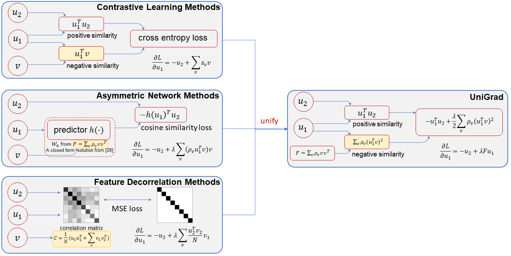

# UniGrad

By [Chenxin Tao](https://scholar.google.com/citations?user=sXHFIBkAAAAJ&hl=zh-CN),
[Honghui Wang](https://scholar.google.com/citations?user=FzJ1aIsAAAAJ&hl=en),
[Xizhou Zhu](https://scholar.google.com/citations?user=02RXI00AAAAJ),
Jiahua Dong,
[Shiji Song](https://scholar.google.com/citations?user=rw6vWdcAAAAJ&hl=en&oi=ao),
[Gao Huang](http://www.gaohuang.net/),
[Jifeng Dai](https://jifengdai.org/)

This is the official implementation of the CVPR 2022 paper [Exploring the Equivalence of Siamese Self-Supervised Learning via A Unified Gradient Framework](https://arxiv.org/abs/2112.05141).

## News
- 2022.6.28: See [Siamese Image Modeling](https://arxiv.org/pdf/2206.01204.pdf) for an application of UniGrad.
- 2022.6.28: Release code for UniGrad and gradient implementations for other methods.

## Introduction

We propose a unified framework for different self-supervised learning methods through the perspective of gradient analysis. It turns out that previous methods share similar gradient structures (positive gradient + negative gradient) as well as similar performances. Based on these analysis, we propose UniGrad as a concise and effective method for self-supervised learning.



| Method | Loss formula |
|:-----:|:---|
| contrastive learning | $L=\mathbb{E}\_{u_1, u_2}\bigg[-\log\frac{\exp{(\mathrm{cos}(u_1^o, u_2^t)/\tau)}}{\sum_{v^t}\exp{(\mathrm{cos}(u_1^o, v^t)/\tau)}}\bigg]$ |
| asymmetric networks | $L = \mathbb{E}\_{u_1,u_2}\bigg[-\mathrm{cos}(h(u_1^o), u_2^t)\bigg]$ |
| feature decorrelation | Barlow Twins: $L = \sum\_{i}{(W\_{ii}-1)^2+\lambda\sum\_{i}{\sum\_{j\ne{i}}}{W\_{ij}^2}}$ <br> VICReg: $L = \frac{1}{N}\sum_{v_1^o, v_2^s}\|\|v_1^o-v_2^s\|\|_2^2 + \frac{\lambda_1}{c}\sum\_{i,j\ne i}W\_{ij}'^2 + \frac{\lambda_2}{c}\sum\_{i}\max(0, \gamma - \mathrm{std}(v_1^o)_i)$  |
| UniGrad | $L=\mathbb{E}\_{u_1, u_2}\bigg[-\cos(u_1^o, u_2^m) + \frac{\lambda}{2} \sum\_{v_o} \rho_v\cos^2(u_1^o, v^o)\bigg]$ |

| Method | Gradient formula |
|:-----:|:---|
| contrastive learning | $\frac{\partial L}{\partial u_1^o} = -u_2^m + \lambda \sum_vs_vv,$<br> where $s_v$ is the softmax results over similarities. |
| asymmetric networks | $\frac{\partial L}{\partial u_1^o} = -u_2^m + \lambda \sum_v\rho_v(u_1^Tv)v$ |
| feature decorrelation | $\frac{\partial L}{\partial u_1^o} = -u_2^m + \lambda \sum_v\frac{u_2^Tv_2}{N}v_1$ |
| UniGrad | $\frac{\partial L}{\partial u_1^o} = -u_2^m + \lambda Fu_1^o,$<br> where $F$ is the moving average of correlation matrix. |


## Main Results and Pretrained models

| Loss | Model | Epoch | Ori. Top1 acc. | Grad. imple.<br> w/o mm enc. | Grad. imple.<br> w/ mm enc. | config | Pretrained model |
|:-----:|:---:|:---:|:---:|:---:|:---:|:---:|:---:|
|***Contrastive Learning***|
|MoCo | R50 | 100 | 67.4 | 67.6 | 70.0 | - | - |
|SimCLR | R50 | 100 | 62.7 | 67.6 | 70.0 |[config](./configs/simclr_grad_mm.py)| - |
|***Asymmetric Networks***|
|SimSiam | R50 | 100 | 68.1 | 67.9 | 70.2 | - | - |
|BYOL | R50 | 100 | 66.5 | 67.9 | 70.2 |[config](./configs/byol_directpred_grad.py)| [model](https://github.com/fundamentalvision/UniGrad/releases/download/v1.0/byol_grad_pretrained.pth) |
|***Feature Decorrelation***|
|VICReg | R50 | 100 | 68.6 | 67.6 | 69.8 | - | - |
|Barlow Twins | R50 | 100 | 68.7 | 67.6 | 70.0 |[config](./configs/barlow_twins_grad_mm.py)| [model](https://github.com/fundamentalvision/UniGrad/releases/download/v1.0/barlow_twins_grad_mm_pretrained.pth) |
|***UniGrad***|
|UniGrad| R50 | 100 | - | - | 70.3 |[config](./configs/unigrad.py)| [model](https://github.com/fundamentalvision/UniGrad/releases/download/v1.0/unigrad_pretrained.pth) |
|UniGrad+cutmix| R50 | 800 | - | - | 74.9 | - | - |


Note:

(1) The numbers for original versions come from original papers, and all gradient versions are implemented by us;

(2) For MoCo, SimCLR and BYOL, our results improve upon their original performances by a large margin. The improvements mainly come from a stronger projector (3 layers with 2048 hidden dimension). Similarly, original Barlow Twins and VICReg get better results because they use a 3-layer MLP with 8192 hidden dimension for the projector. 

## Usage
### Preparation

The pretraining only requires installing pytorch and downloading ImageNet dataset, whose detailed instructions can be found [here](https://github.com/pytorch/examples/tree/main/imagenet).

To conduct the linear evaluation, [apex](https://github.com/NVIDIA/apex) should be installed because [LARS](https://github.com/NVIDIA/apex/blob/master/apex/parallel/LARC.py) optimizer is used.

### Pretraining

To conduct pretraining, fill the dataset path into the config, and run the following command: 

```
./run_pretrain.sh {CONFIG_NAME} {NUM_GPUS}
```

For example, the command for pretraining with UniGrad on 8 GPUs is as follows:

```
./run_pretrain.sh ./configs/unigrad.py 8
```
With 8 gpus, a 100-ep experiment usually requires 38 hours to finish, which is also reported in the paper. 


### Linear evaluation

To conduct linear evaluation, run the following command: 

```
./run_linear.sh {PRETRAINED_CKPT} {DATA_PATH} {NUM_GPUS}
```
Note that for 100-ep pretrained model, the base learning rate is set to 0.1, which just follows the evaluation setting of [SimSiam](https://github.com/facebookresearch/simsiam). With our provided pretrained model, this command should give ~70 top-1 accuracy.


## Todo
- [ ] release pretrained model without momentum encoder
- [ ] release 800ep UniGrad pretrained model
- [ ] support vit structure


## License

This project is released under the [Apache 2.0 license](./LICENSE).

## Citing UniGrad
If you find UniGrad useful in your research, please consider citing:
```bibtex
@inproceedings{tao2022exploring,
  title={Exploring the equivalence of siamese self-supervised learning via a unified gradient framework},
  author={Tao, Chenxin and Wang, Honghui and Zhu, Xizhou and Dong, Jiahua and Song, Shiji and Huang, Gao and Dai, Jifeng},
  booktitle={Proceedings of the IEEE/CVF Conference on Computer Vision and Pattern Recognition},
  pages={14431--14440},
  year={2022}
}
```
